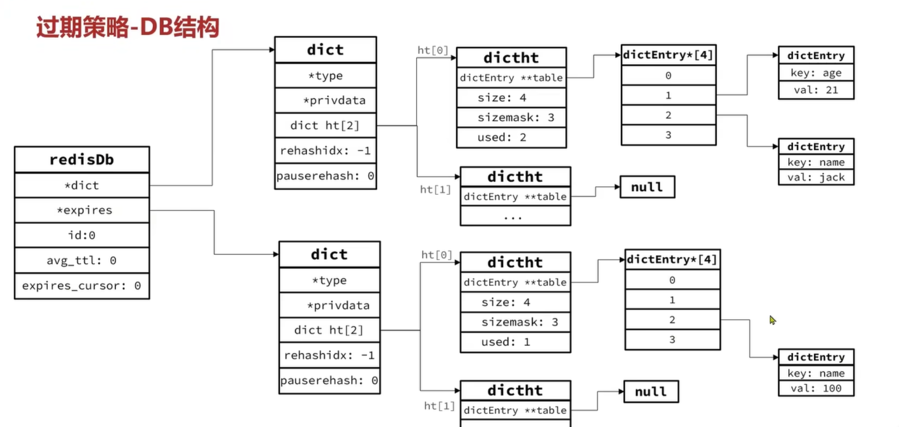
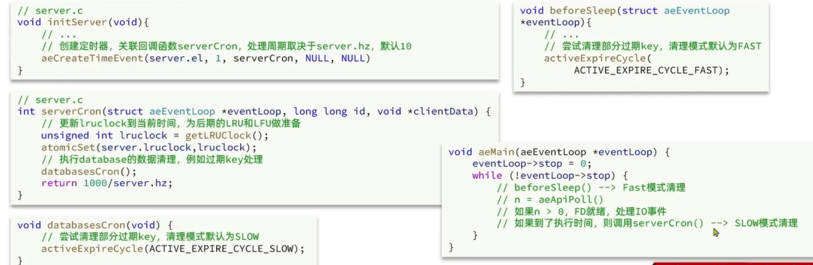
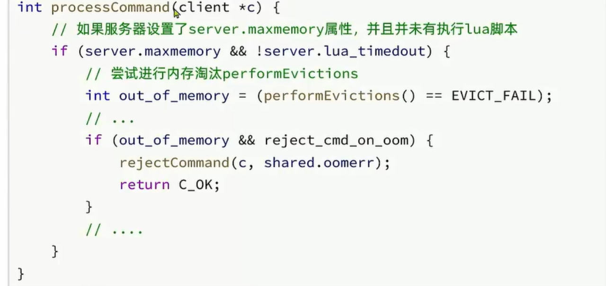
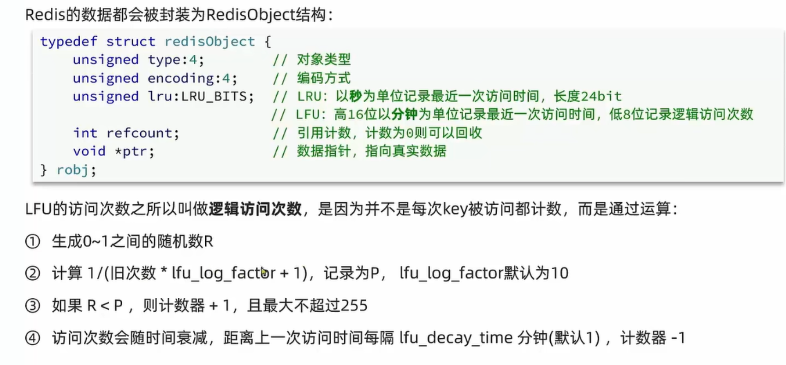

## 过期策略

1、可以通过expire命令给Redis的key设置TTL(存活时间)   
```redis
set name jack
expire name 10
```
可以发现，当key的TTL过期后，再次访问name返回的是nil，说明这个key已经不存在了，对应的内存也得到了释放，从而起到内存回收的功能。    

Redis本身是一个典型的key-value内存存储数据库，因此所有的key、value都保存在之前所学的Dict结构中。不过在其Database结构体中，有两个Dic：一个用来记录key-value,另一个用来记录key-TTL。   



[redisDb结构体源码](src/server.h)

> Redis是如何知道一个key是否过期的呢？
>> 利用两个Dict分别记录key-value以及key-TTL

> 是不是TTL到期立即删除了呢？
>> 惰性删除   
>>>顾名思义并不是在TTL到期后就立刻删除，而是当访问到这个key时，检查该key的存活时间，如果已经过期了，就删除该key。
> 
>> 周期删除
>>> 顾名思义就是通过一个定时任务，周期性的抽样部分过期的key，然后执行删除。执行周期有两种：     
>>>1、Redis会设置一个定时任务serverCron(),按照server.hz的频率来执行过期key清理，模式为 SLOW     
>>> SLOW模式规则    
>>>> 1、执行频率受server.hz影响，默认10，也就是每秒执行10次，每个执行周期100ms。   
>>>> 2、执行清理耗时不超过一个周期的25%.    
>>>> 3、逐个遍历DB，逐个遍历DB中的bucket，抽取20个key判断是否过期   
>>>> 4、如果没达到时间上限(默认25ms)并且过期key比例大于10%，在进行一次抽样，否则结束。   
> 
>>>2、redis的每个时间循环前会调用beforeSleep()函数，执行过期key清理，模式为  FAST    
>>> FAST模式规则     
>>>> 1、执行频率受beforeSleep()调用频率影响，但两次Fast模式间隔不低于2ms    
>>>> 2、执行清理耗时不超过1ms   
>>>> 3、逐个遍历DB，逐个遍历DB中的bucket，抽取20个key判断是否过期     
>>>> 4、如果没达到时间上限(默认1ms)并且过期key比例大于10%，进行一次抽样，否则结束。
>



## 淘汰策略

内存淘汰： 就是当redis内存使用达到设置的阈值时，Redis主动挑选部分key删除以达到释放更多内存的流程。   
Redis会在处理客户端命令的方法processCommand()中尝试做内存淘汰：   
]

> Redis支持8种不同策略来选择要删除的key：     
>> 1、noeviction: 不淘汰任何key，但内存满时不允许写入新数据，默认就是这种策略。     
>> 2、volatile-ttl: 对设置了TTL的key，比较key的剩余TTL值，TTL越小越先被淘汰。     
>> 3、allkey-random: 对全体key，随机进行淘汰。也就是直接从db-dict中随机挑选。     
>> 4、volatile-random: 对设置了TTL的key，随机进行淘汰。也就是从db-expires中随机挑选。     
>> 5、allkey-lru: 对全体key，基于LRU算法进行淘汰。       
>> 6、volatile-lru: 对设置了TTL的key，基于LRU算法进行淘汰。     
>> 7、allkey-lfu: 对全体key，基于LFU算法进行淘汰。   
>> 8、volatile-lfu: 对设置了TTL的key，基于LFU算法进行淘汰。
> 
> LRU(Least Recently Used): 最长时间未被使用，也就是当前时间减去最后后一次访问时间，这个值越大则淘汰优先级越高。  
> LFU(Least Frequently Used): 使用频率最低，会统计key被访问的频率，这个值越小则淘汰优先级越高。

Redis的数据都会被分装为RedisObject结构：
