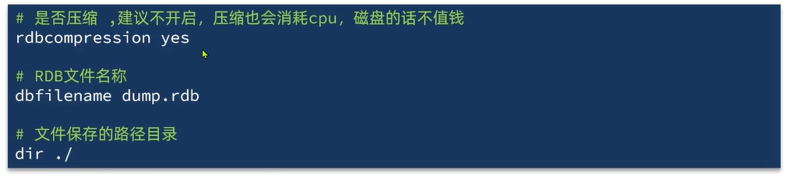
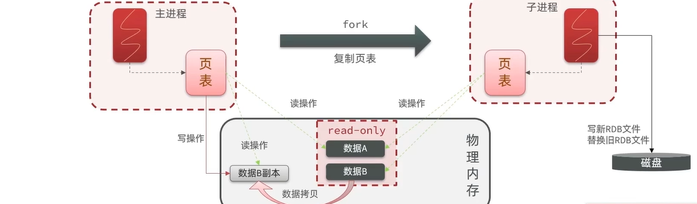
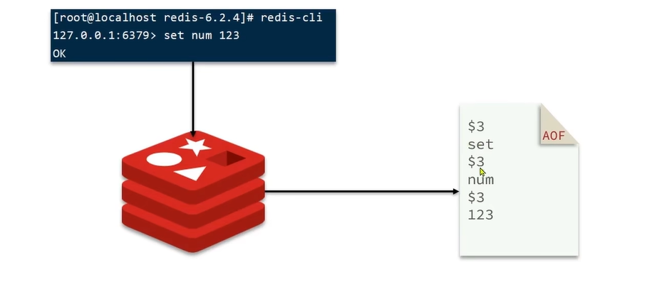

# Redis集群
## RDB持久化
> RDB 全称 Redis Database Backup file(redis数据备份文件)，也叫做Redis数据快照。简单来说就是把内存中的所有数据都记录到磁盘中。当Redis实例故障重启后，从磁盘取快照文件，恢复数据。  
> 快照文件称为RDB文件，默认是保存在当前运行目录  
>Redis停机时会执行依次RDB

  

Redis内部有触发RDB的机制，可以在Redis,conf文件中找到，格式如下  
 

RDB的其他配置也可以在redis.conf文件中设置：  

bgsave开始时会fork主进程得到子进程，子进程共享主进程的内存数据。完成fork后，子进程读取内存数据并写入RDB文件。  
fork采用的是copy-on-write技术：  
1、当主进程执行读操作时，访问共享内存；  
2、当主进程执行写操作时，则会拷贝一份数据，执行写操作。

RBD方式bgsave的基本流程？  
1、fork主进程得到一个子进程，共享内存空间  
2、子进程读取内存数据并写入到新的RDB文件   
3、用新RDB文件替换旧的RDB文件  

RDB的缺点   
1、RDB执行间隔时间长，两次RDB之间写入数据有丢失风险   
2、fork子进程、压缩、写出RDB文件都比较耗时   

---

## AOF持久化  
> AOF的全称是Append Only File，也叫追加文件，Redis处理的每一个写命令都会记录在AOF文件，可以看作是命令日志文件。  

