## String
String是Redis中最常见的数据存储类型：  
1、其基本编码方式是RAW，基于简单动态字符串(SDS)实现，存储上限是512MB。    

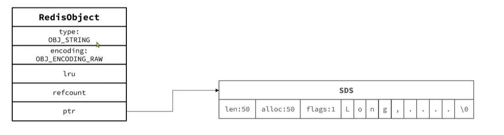

2、如果存储的SDS长度小于44字节，则会采用EMBSTR编码，此时object head与SDS是一段连续空间。申请内存时只需要调用一次内存分配函数，效率更高。  

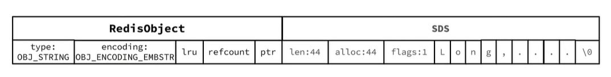

3、如果存储的字符串时整数数值，并且大小在LONG_MAX范围内，则会采用INT编码：直接将数据保存在RedisObject的ptr指针位置(刚好8个字节)，不再需要SDS结构了。  

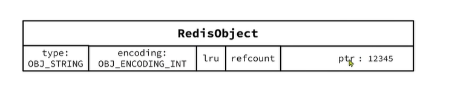

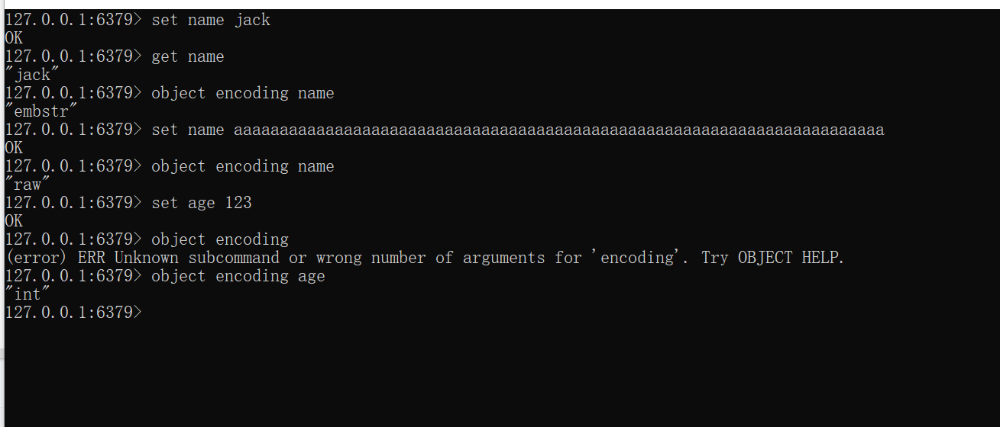

## List
Redis的list类型可以从首、尾操作列表中的元素  

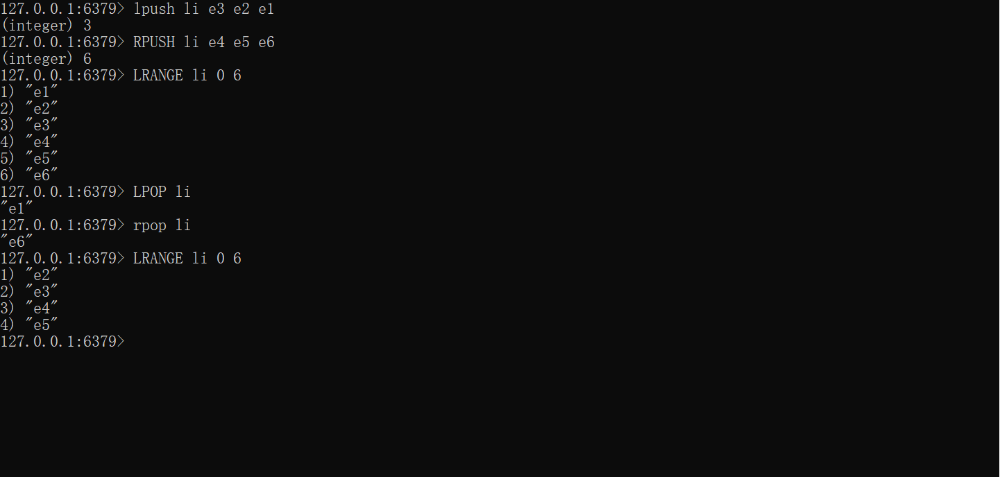  

哪种数据结构可以实现上述特征？  
1、LinkedList: 普通链表，可以双端访问，可是内存占用高(因为节点之间的关联是通过指针来关联，因此节点需要分出部分内存来保存指针，从而导致内存占用较高)，内存碎片较多。  
2、ZipList： 压缩列表，可以从双端访问，内存占用低，但是存储上限低(因为它的是一块连续的内存空间从而不需要指针，如果存储数据较多的情况下，不容易分配内存空间)。  
3、QuickList： 底层实际就是LinkedList+ZipList，可以双端访问，内存占用较低，包含多个ZipList，存储上限高。   
---
 * 在3.2版本之前，Redis采用ZipList和LinkedList来实现List，当元素数量小于512并且元素大小小于64字节时采用ZipList编码，超过则采用LinkedList编码。  
 * 在3.2版本之后，Redis统一采用QUickList来实现。 [List类型结构源码](src/t_list.c) 
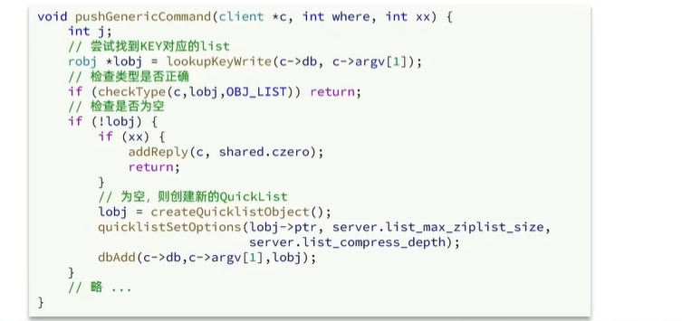

List结构图如下：  

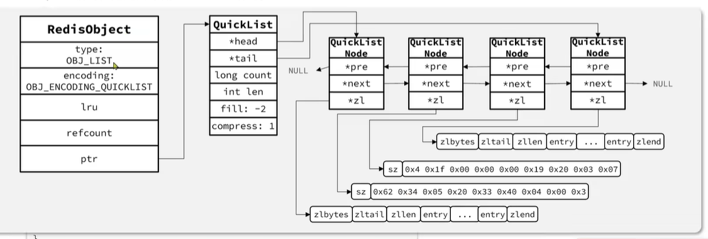

---

## Set
Set是Redis中的单列结合，满足下列特点：  
1、不保证有序性  
2、保证元素唯一(可以判断元素是否存在)
3、求交集、并集、差集  

 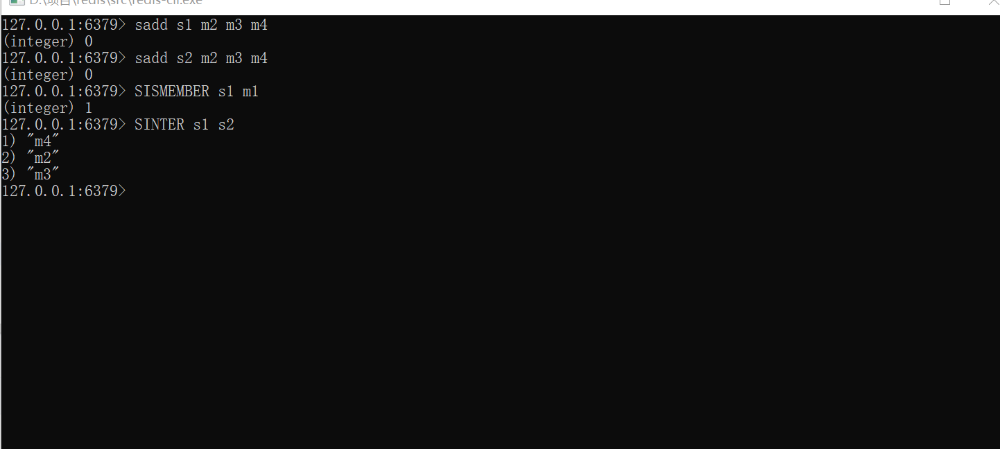
 
可以看出，Set对查询元素的效率要求非常高，思考一下，什么样的数据类型可以满足？  
hashTable(Dict),也就是Redis中的Dict，不过Dict是双列集合(可以存键、值对)  

---
Set是Redis中的集合，不一定确保元素有序，可以满足元素唯一、查询效率要求极高。   
为了查询效率和唯一性，set采用HT编码(Dict)。Dict中的Key用来存储元素，value统一为null。    
当存储的所有数据都是整数，并且元素数据不超过set-max-intset-entries时，Set会采用IntSet编码，以节省内存。   

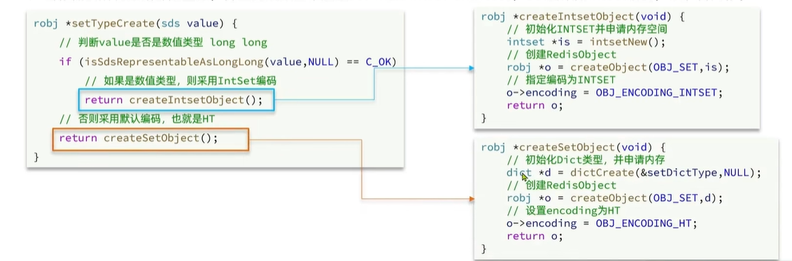

[Set集合源码](src/t_set.c)

Set内存结构以及流程变化图如下:  

1、初始时，是一个数字类型set，存储的元素个数在set-max-intset-entries范围内，此时采用IntSet编码。

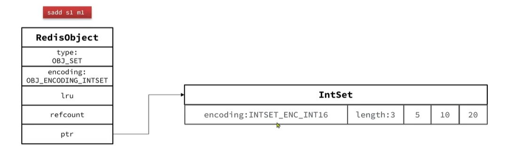

2、此时插入一个 "m1" 数据，这时数据结构编码就会从IntSet转成HT(Dict),首先会先创建一个Dict   

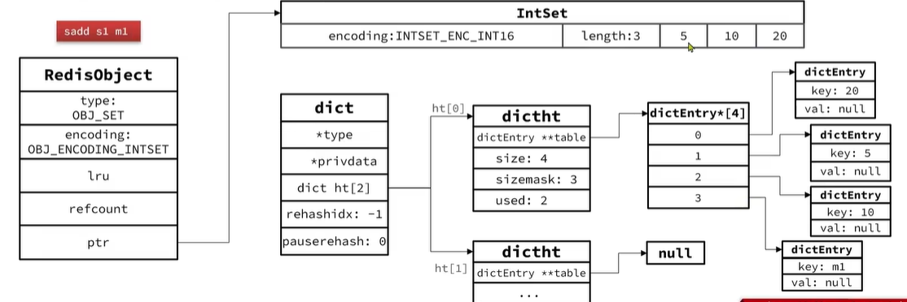

3、最后在把RedisObject的ptr指针指向Dict，并且把编码改成OBJ_ENCODING_HT     

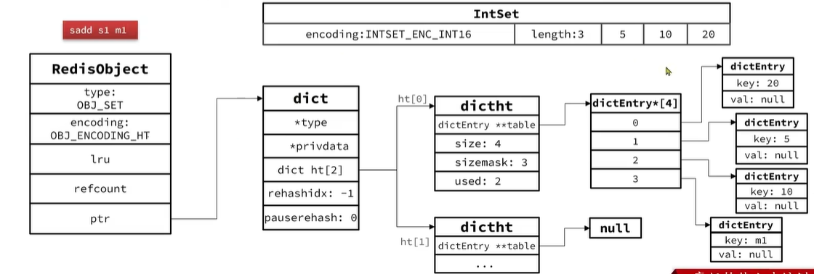

---

## ZSet
