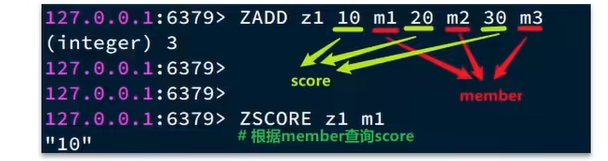
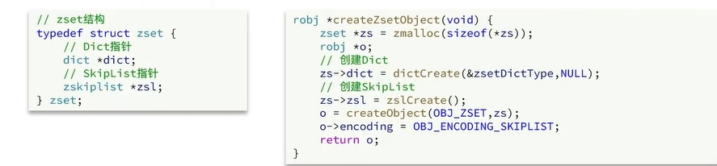
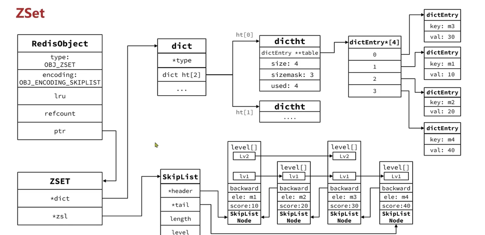
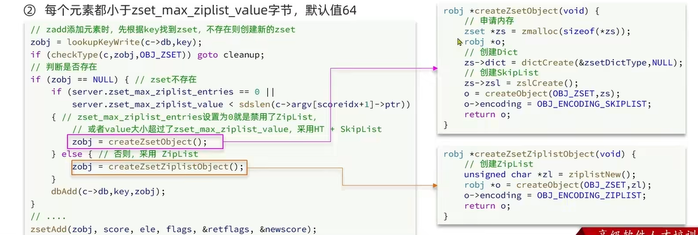
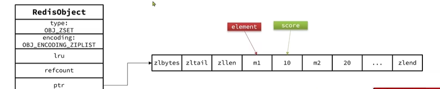
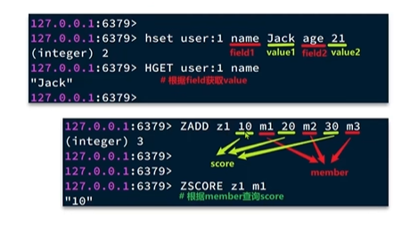
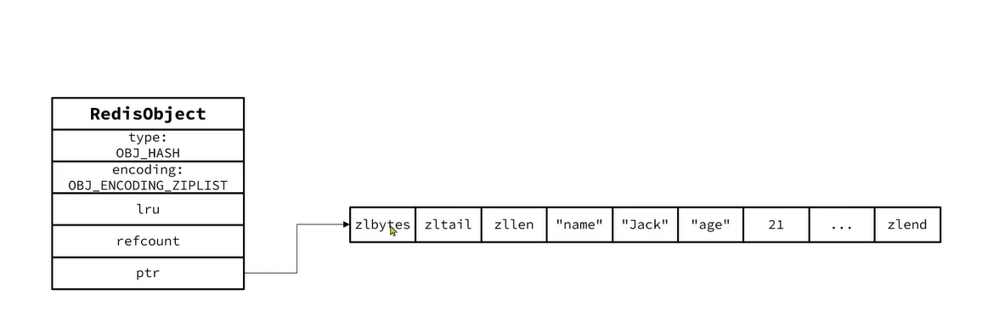
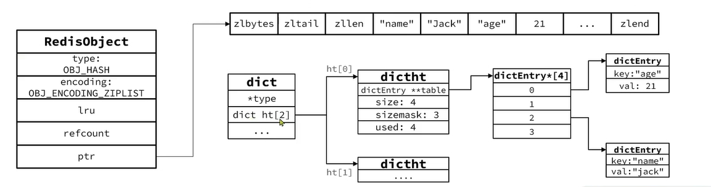
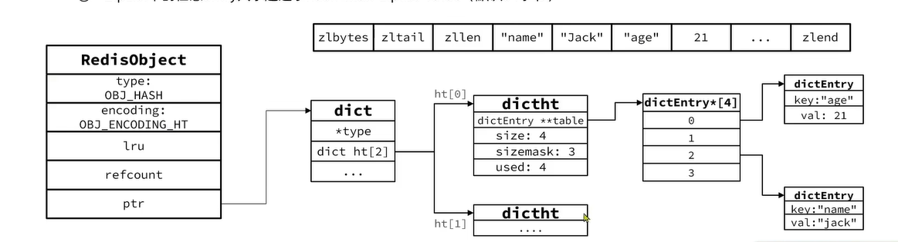

## String
String是Redis中最常见的数据存储类型：  
1、其基本编码方式是RAW，基于简单动态字符串(SDS)实现，存储上限是512MB。    

2、如果存储的SDS长度小于44字节，则会采用EMBSTR编码，此时object head与SDS是一段连续空间。申请内存时只需要调用一次内存分配函数，效率更高。  

3、如果存储的字符串时整数数值，并且大小在LONG_MAX范围内，则会采用INT编码：直接将数据保存在RedisObject的ptr指针位置(刚好8个字节)，不再需要SDS结构了。  

## List
Redis的list类型可以从首、尾操作列表中的元素  

  

哪种数据结构可以实现上述特征？  
1、LinkedList: 普通链表，可以双端访问，可是内存占用高(因为节点之间的关联是通过指针来关联，因此节点需要分出部分内存来保存指针，从而导致内存占用较高)，内存碎片较多。  
2、ZipList： 压缩列表，可以从双端访问，内存占用低，但是存储上限低(因为它的是一块连续的内存空间从而不需要指针，如果存储数据较多的情况下，不容易分配内存空间)。  
3、QuickList： 底层实际就是LinkedList+ZipList，可以双端访问，内存占用较低，包含多个ZipList，存储上限高。   
---
 * 在3.2版本之前，Redis采用ZipList和LinkedList来实现List，当元素数量小于512并且元素大小小于64字节时采用ZipList编码，超过则采用LinkedList编码。  
 * 在3.2版本之后，Redis统一采用QUickList来实现。 [List类型结构源码](src/t_list.c) 

List结构图如下：  

---

## Set
Set是Redis中的单列结合，满足下列特点：  
1、不保证有序性  
2、保证元素唯一(可以判断元素是否存在)
3、求交集、并集、差集  

 
 
可以看出，Set对查询元素的效率要求非常高，思考一下，什么样的数据类型可以满足？  
hashTable(Dict),也就是Redis中的Dict，不过Dict是双列集合(可以存键、值对)  

---
Set是Redis中的集合，不一定确保元素有序，可以满足元素唯一、查询效率要求极高。   
为了查询效率和唯一性，set采用HT编码(Dict)。Dict中的Key用来存储元素，value统一为null。    
当存储的所有数据都是整数，并且元素数据不超过set-max-intset-entries时，Set会采用IntSet编码，以节省内存。   

[Set集合源码](src/t_set.c)

Set内存结构以及流程变化图如下:  

1、初始时，是一个数字类型set，存储的元素个数在set-max-intset-entries范围内，此时采用IntSet编码。

2、此时插入一个 "m1" 数据，这时数据结构编码就会从IntSet转成HT(Dict),首先会先创建一个Dict   

3、最后在把RedisObject的ptr指针指向Dict，并且把编码改成OBJ_ENCODING_HT     

---

## ZSet

ZSet也就是SortedSet,其中每个元素都需要指定一个score值和member值：   
1、可以根据score值排序  
2、member必须唯一  
3、可以根据member查询score

  

因此，zset底层数据结构必须满足键值存储，键必须唯一、可排序这几个需求：  
1、SkipList：可以排序，并且可以同时存储score和ele值（member）  
2、HT(Dict): 可以键值存储，并且可以根据key找value

[ZSet结构源码](src/server.h)  

以下是ZSet结构图：   

由结构图可知：  
1、ZSet通过Dict(HT哈希表),保证了key(也就是member值)的唯一性，同时也方便ZSet可用通过member快速查找score(也就是Dict中的value)  
2、ZSet通过SkipList(跳表)，可以保证score的有序性，并且可以同时存储score和ele值(member)  
3、但是唯一的确定就是内存占用高，因为保存了两份相同的数据，一份在Dict中，一份在SkipList中  

为了优化上述问题：   
当元素数量不多时，HT和SkipList的优势不明显，而且更耗内存。因此zset还会采用ZipList结构来节省牛村，不过徐娅萍同时满足两个条件：  
1、元素数量小于zset_max_ziplist_entries，默认值128  
2、每个元素都小于zset_max_ziplist_value，默认值64  

zipList本身没有排序功能，而且没有键值对的概念，因此需要由zset通过编码实现：  
1、ZipList是连续内存，因此score和element是紧挨在一起的两个entry，element在前，score在后  
2、score越小越接近队首，score越大越接近队尾，按照score值升序排列。  

## Hash

Hash结构与Redis中的ZSet结构非常类似：  
1、都是键值存储  
2、都需求根据键找值  
3、建必须唯一  

  

和ZSet的区别：  
1、zset的键是member，值是score；hash的键值可以是任意值  
2、zset要根据score排序，也就是说值必须是数字；hash是无序的，所以没这个特点  
因此，Hash底层采用的编码与Zset编码基本一致，只需要把排序有关的SkipList去掉即可。  
1、Hash结构默认采用ZipList编码用以节省内存。ZipList中相邻的两个entry分别保存field和value

2、当数据量较大时，Hash结构会转为HT编码，也就是Dict，触发条件有两个:  
1、ZipList中的元素数量超过hash-max-ziplist-entries，默认值512；  
2、ZipList中的元素大小超过hash-max-ziplist-value，默认值64字节。  

