## Redis数据结构
### 态字符串SDS  
> 我们指导Redis中保存的Key是字符串，value往往是字符串或者字符串的集合，可见字符串是Redis中最常见的一种数据结构。  
> 不过Redis没有直接使用C语言中的字符串，因为C语言字符串存在很多问题：  
> 1、获取字符串长度的需要通过运算  
> 2、非二进制安全  
> 3、不可修改  
> Redis构建了一种新的字符串结构，称之为简单动态字符串(Simple Dynamic String)，简称SDS。
```markdown
struct __attribute__ ((__packed__)) sds {
    uint8_t len;  // buf 已保存的字符串字节数，不包含结束标示
    uint8_t alloc; // buf 申请的总的字节数，不包含结束标示
    unsigned char flags; // 不同SDS的头类型，用来控制SDS的头大小
    char buf[];
}
```
> SDS之所以叫动态字符串，是因为它具有动态扩容能力。  
> 如果新字符串小于1M,则新空间为扩展后字符串长度的两倍+1  
> 如果新字符串大于1M,则新空间为扩展后字符串长度+1M+1。称为内存预分配（内存预分配可减少分配内存的时间开销）  

> 优势  
> 1、获取字符长度的时间复杂度是O(1)，不需要进行运算。
> 2、支持动态扩容。
> 3、减少内存分配次数。
> 4、支持二进制安全。
### IntSet
> IntSet是Redis中set集合的一种实现，基于整数数组来实现的，并且具备长度可变、有序等特征。  
结构如下
---
```text
typedef struct intset {
    uint32_t encoding;  // 编码方式，支持放16、32、64位整数
    uint32_t length;    // 实际存储的整数个数，也就是元素个数
    int8_t contents[];  // 整数数组，保存集合数据
} intset;
```
其中的encoding包含三种模式，表示存储的整数大小不同：

```text
#define INTSET_ENC_INT16 (sizeof(int16_t))  // 2字节整数，范围类似java的short类型
#define INTSET_ENC_INT32 (sizeof(int32_t))  // 4字节整数，范围类似java的int类型
#define INTSET_ENC_INT64 (sizeof(int64_t)) // 8字节整数，范围类似java的long类型
```

为了方便查找，Redis会将intset中所有的整数按照升序依次保存在contents数组中，结构图如下：
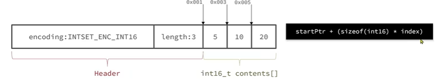

---

现在数组中每个数字都在int16_t的范围内，因此采用的编码方式是INTSET_ENC_INT16。，每部分占用的字节大小为：  
encoding：4字节  
length：4字节  
contents：2字节*3=6字节。

---
IntSet升级  
现在，假设有一个intset，元素为{5，10，20}，采用的是INTSET_ENC_INT16,则每个整数占2字节:

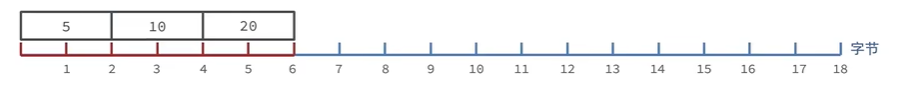

我们向其中添加一个数字：50000，这个数字超出了int16_t的范围，intset会自动升级编码方式到合适的大小。
以当前案例来说，流程如下：  
1、升级编码为INTSET_ENC_INT32,每个整数占4个字节，并按照新的编码方式以及元素个数扩容数组。  
2、倒叙依次将数组中的元素拷贝到扩容后的正确位置

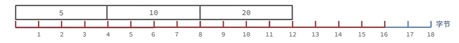

3、将待添加元素放入数组末尾

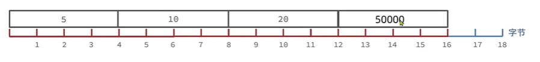

4、最后，将intset的encoding属性改为INTSET_ENC_INT32，将length属性改为4

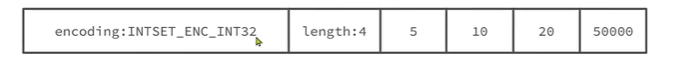  

Intset可以看做是特殊的整数数组，具备一些特点：   
1、Redis会确保Intset中的元素唯一、有序。  
2、具备类型升级机制，可以节省内存空间。  
3、底层采用二分查找方式来查询。  
4、适合数据量比较少的情况下使用。   

Redis的Intset(整数集合)是专门为set集合数据类型设计的一种底层数据结构，用于在特定条件下优化内存和性能：  
1、所有元素都是整数(int64_t范围内的值)  
2、元素数量少(默认阈值：set-max-intset-entries,默认值是512，可配置)  
<font color="red">如果上述任一条件都不满足，Redis会自动将Intset升级为Hash表(Dict)结构存储。</font>    
详细源码可参考[Redis源码解析之IntSet](src/intset.h)

### Dict基本结构    
> 我们知道Redis是一个键值型(Key-Value Pair)的数据库，我们可以根据键实现快速的增删改查。而键与值的映射关系正是通过Dict实现的。
---
Dict由三部分组成：哈希表(DictHashTable)、哈希节点(DictEntry)、字典(Dict)
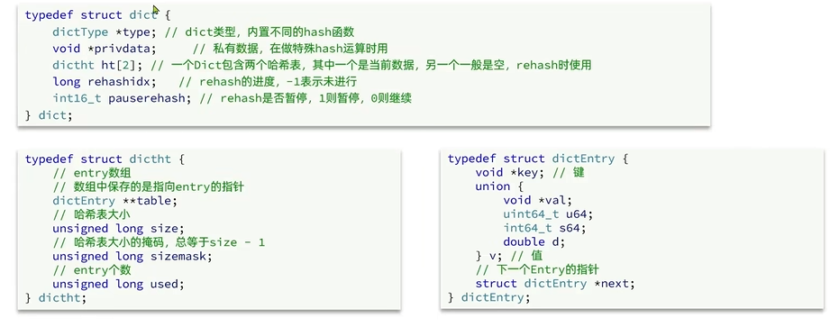
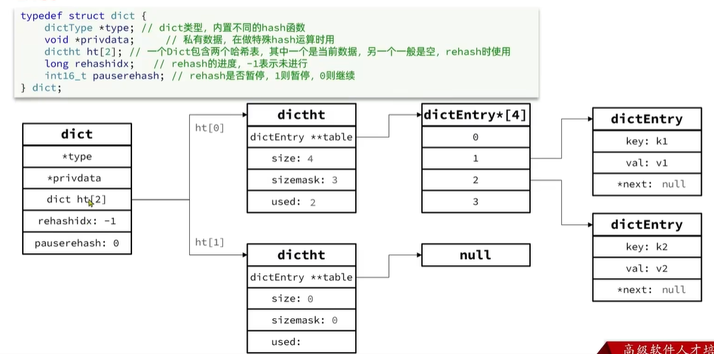
当我们向Dict添加键值对时，Redis首先根据Key计算出Hash值(h)，然后利用 h&sizemask 来计算应该存储到数组中的哪个索引位置。  
例如我们存储k1=v1，假设k1的哈希值h=1，则1&3=1，因此k1=v1要存储到数组角标1的位置。
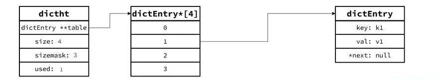

如果我们继续存储k2=v2，假设k2的哈希值和key1相等时，则会在v1的位置指向k2，然后key2中的 *next 指向key1，形成了这么一个链表的结构。

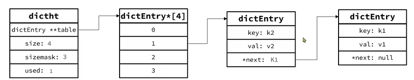
### Dict扩容
> Dict中的HashTable就是数组结合单向链表实现的，当集合中元素较多时，必然导致哈希冲突增多，链表过长，则查询效率会大大降低。
---
Dict在每次新增键值对时都会检查负载因子(LoadFactor=used/size),满足以下两种情况时会触发哈希表扩容：  
1、LoadFactor>=1,并且服务器没有执行BGSAVE或者BGREWRITEAOF等后台进程;
2、LoadFactor>5；
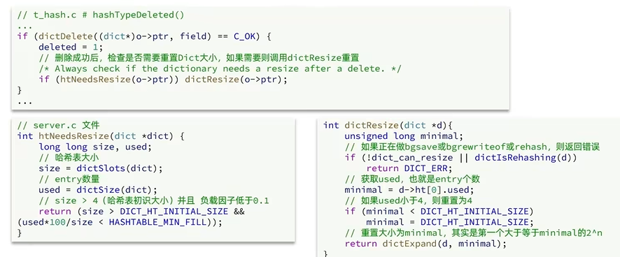
[Reis中hash表扩容源码](src/dict.c)中的dictExpandIfNeeded(dict *d)方法
### Dict收缩
> Dict除了扩容以外，每次删除元素时，也会对负载因子做检查，当LoadFactor<0.1时，会做哈希表收缩:
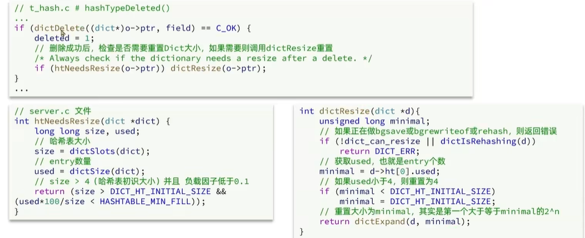
### Dict的rehash
> Dict在扩容和收缩时，必定会创建新的哈希表，导致哈希表的size和sizemask变化，而key的查询与sizemask有关。
> 因此必须对哈希表中的每一个key重新计算索引，插入新的哈希表，这个过程称为rehash。过程如下：
---
1、计算新hash表的realeSize，值取决于当前要做的是扩容还是收缩:  
&emsp;&emsp;如果是扩容，则新size为第一个大于等于dict.ht[0].used+1的第一个2的n次方  
&emsp;&emsp;如果是收缩，则新size为第一个大于等于dict.ht[0].used的第一个2的n次方(不得小于4)  
2、按照新的realeSize申请内存空间，创建dictht，并赋值给dict.ht[1]  
3、设置dict.rehashids=0，标示开始rehash  
4、将dict.ht[0]中的每一个dictEntry都rehash到dict.ht[1]  
5、将dict.ht[1]赋值给dict.ht[0],给dict.ht[1]初始化为空哈希表，释放原来的dict.ht[0]的内存  
---
通过一下流程图可只管的看到rehash的演变过程：  
1、初始时

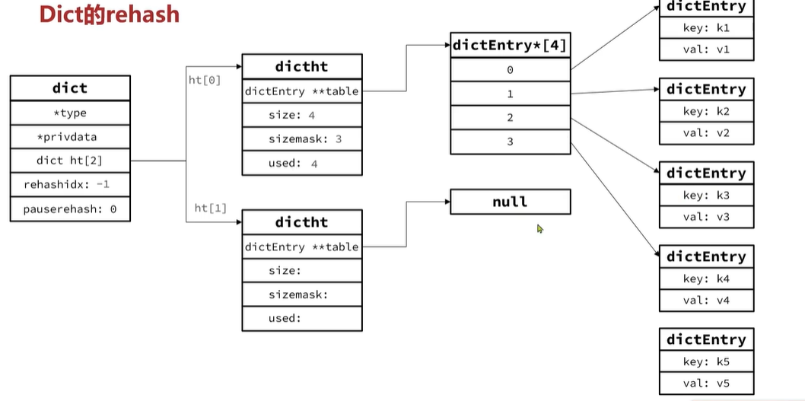

2、当插入key5时，便会触发扩容，新size为第一个大于等于dict.ht[0].used+1的第一2的n次方，即使比5+1=6大的第一个2的n次方为8，按照新的realeSize申请内存空间，创建dictht，并赋值给dict.ht[1]

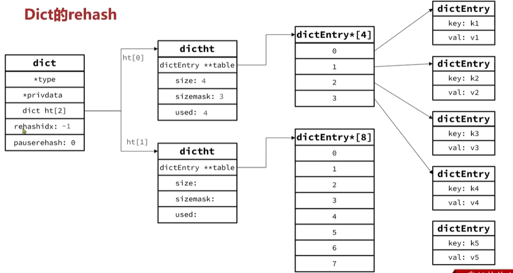

3、当为ht[1]分配完内存后，设置rehashids=0，标示开始rehash

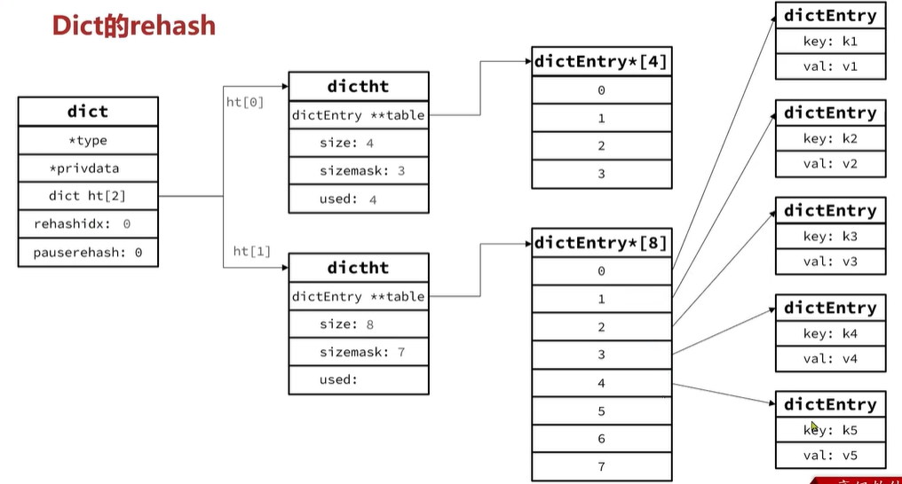

4、将ht[0]中的每一个dictEntry都指向到ht[1]，ht[1]的dictEntry重新指向null

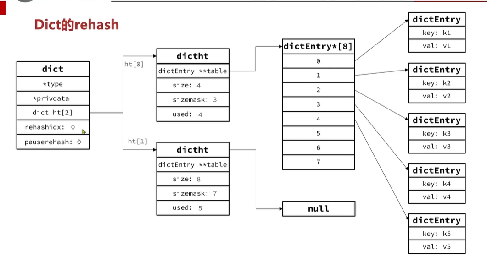

5、最后把dict的rehashids设置为-1和更新ht[0]和ht[1]的size、sizemask、used的值表示rehash过程结束

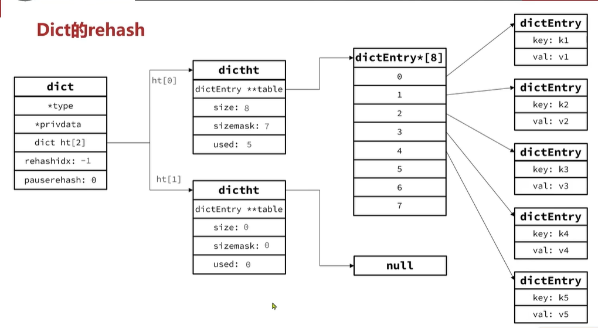

----
Dict的rehash并不是一次性完成的。如果Dict中包含了数百万的entry(元素),要在一次rehash完成，极有可能导致主线程阻塞。  
因此Dict的rehash是分多次、渐进式的完成的，因此称为渐进式rehash。流程如下：  
----
1、计算新hash表的size，值取决于当前要做的是扩容还是收缩:  
&emsp;&emsp;如果是扩容，则新size为第一个大于等于dict.ht[0].used+1的第一个2的n次方  
&emsp;&emsp;如果是收缩，则新size为第一个大于等于dict.ht[0].used的第一个2的n次方(不得小于4)    
2、按照新的size申请内存空间，创建dictht，并赋值给dict.ht[1]  
3、设置dict.rehashids=0，标示开始rehash  
<font color="red">4、每次执行新增、查询、修改、删除操作时，都会检查一下dict.rehashidx是否大于-1，如果是则将dict.ht[0].table[rehashidx]的entry链表rehash到dict.ht[1],并且将rehashidx++。直到dict.ht[0]的所有数据都rehash到dict.ht[1]。
</font>  
5、将dict.ht[1]赋值给dict.ht[0],给dict.ht[1]初始化为空哈希表，释放原来的dict.ht[0]的内存  
6、将rehashidx赋值为-1，代表rehash结束。  
7、在rehash过程中，新增操作，直接写入ht[1]，查询、修改和删除则会在dict.ht[0]和dict.[1]依次查找并执行。这样可以确保ht[0]的数据只减不增，随着rehash最终为空
---
##### Dict的结构  
1、类似Java的HashTable，底层是数组+链表来解决哈希冲突。  
2、Dict包含两个哈希表，ht[0]常用，ht[1]用来rehash  
#### Dict的伸缩
1、当LoadFactor大于5或者LoadFactor大于1并且没子进程任务时，Dict扩容
2、当LoadFactor小于0.1时，Dict收缩
3、扩容大小为第一个大于等于used+1的2的n次方
4、收缩大小为第一个大于等于used的2的n次方，不得小于4
5、Dict采用渐进式rehash，每次访问Dict时执行依次rehash
6、rehahs时ht[0]只减不增，新增操作只在ht[1]执行，其他操作在两个哈希表
---

### ZipList
> ZipList是一个压缩列表，是一种特殊的"双端链表"，由一系列特殊编码的连续内存块组成。可以在任意一端进行压入/弹出操作，并且该操作的时间复杂度为O(1).
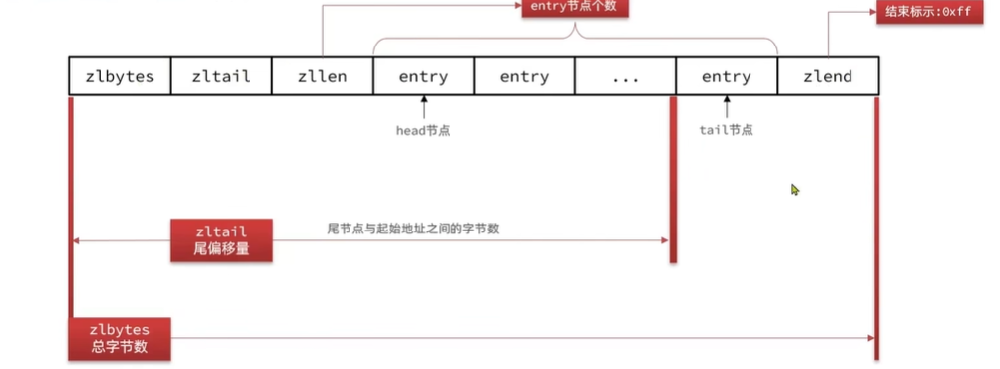
---
zlbytes：uint32_t 类型，长度4个字节，记录整个压缩列表占用的内存字节  
zltail：uint32_t 类型，长度4个字节，记录压缩列表表尾节点距离压缩列表的起始地址有多少个字节，通过偏移量，可以确定表尾节点的地址  
zllen：uint16_t 类型，长度2个字节，记录压缩列表中节点的数量，最大值为UINT16_MAX(65534),如果超过这个值，此处会记录为65535，但节点的真实数量需要遍历整个压缩列表才能计算出来。
entry：列表节点，长度不变，压缩列表包含的各个节点，节点的长度由节点保存的内容决定。  
zlend：uint8_t 类型，长度1个字节，记录压缩列表的结束标志，值为0xFF  

---
ZipList中的Entry并不像普通链表那样记录前后节点的指针，因为记录两个指针要占用16个字节，浪费内存。而是采用了下面的结构：


previous_entry_length：前一节点的长度，占1个字节或者5个字节。  
&emsp;&emsp;如果前一节点的长度小于254字节，则采用1个字节来保存这个长度值。  
&emsp;&emsp;如果前一节点的长度大于254字节，则采用5个字节来保存这个长度，第一个字节为0xfe,后四个字节才是真实长度数据。  
encoding: 编码属性，记录content的数据类型(字符串还是整数)以及长度，占用1、2或者5个字节。  
contents：负责保存节点的数据，可以字符串或整数。
> <font color="red">ZipList中所有存储长度的数值均采用小端字节序，即低位字节在前，高位字节在后。例如数值0下234，采用小端字节序后实际存储值为：0X3412</font>
---
#### Encoding
ZipListEntry中的encoding编码分为字符串和整数两种：  
1、字符串：如果encoding是以"00"、"01"、"10"开头，则证明content是字符串

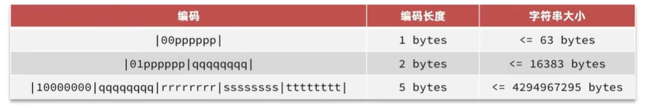
例如：我们要保存字符串："ab"和"bc“
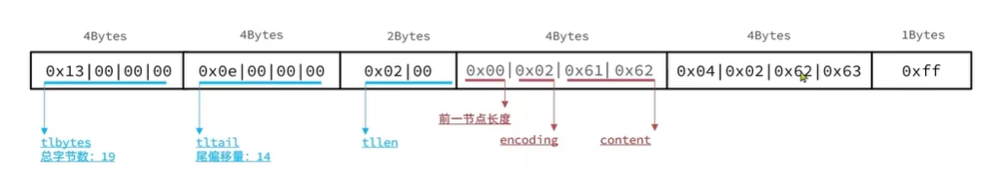

2、数字：如果encoding是以"11"开始，则证明content是整数，且encoding固定只占用1个字节  
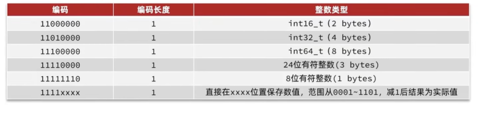

例如: 一个ZipList中包含两个整数值："2"和"5"
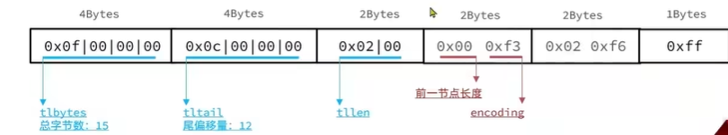

#### ZipList的连锁更新问题  
ZipList的每个Entry都包含previous_entry_length来记录上一个节点的大小，长度是1个或5个字节：  
1、如果前一节点的长度小于254字节，则采用1个字节来保存这个长度值。  
2、如果钱一节点的长度大于等于254字节，则采用5个字节来保存这个长度，第一个字节为0xfe,后四个字节才是真实长度数据。

现在，假设我们由N个连续的、长度为250~253字节之间的entry，因此entry的previous_entry_length属性用1个字节即可表示，如图所示：  

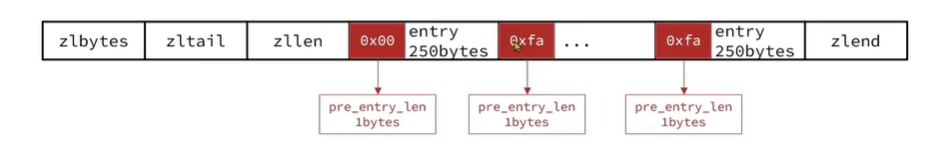
如果此时，在队首增加一个254或254以上字节的entry，这时下一个previous_entry_length使用一个字节就表示不了254，要变成使用5给字节来表示254，同样继续下一个entry因为上一个entry的字节数超出了254，previous_entry_length也需要转变成5个字节从而导致entry的整体字节数超过253，以此类推到最后一个字节。
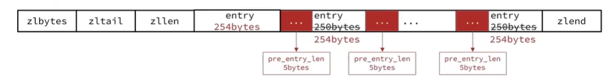

<font color="blue">ZipList这种特殊情况下产生的连续多次空间扩展操作称之为连锁更新(Cascade Update)。新增、删除都可能导致连锁更新的发生</font>

----
ZipList特性：
1、压缩列表的可以看做一种连续内存空间的"双向链表"(注意，ZipList并不是真正的链表)  
2、列表的节点之间不是通过指针连接，而是记录上一节点和本节点长度来寻址，内存占用较低。  
3、如果列表数据过多，导致链表过长，可能影响查询性能。  
4、增加或者删除较大数据时，可能会产生连续更新问题。

----

### QuickList 

----
问题1：ZipList虽然节省内存，但申请内存必须是连续空间，如果内存占用较多，申请内存效率很低。怎么办？  
为了缓解这个问题，我们必须限制ZipList的长度和entry大小  
问题2：但是我们要存储大量数据，超出了ZipList最佳的上限该怎么办？  
我们可以创建多个ZipList来分片存储数据。   
问题3：数据拆分后比较分散，不方便管理和查找，这多个ZipList如何建立联系？     
Redis在3.2版本后引入了新的数据结构QuickList，他是一个双端链表，只不过链表中的每个节点都是一个ZipList。
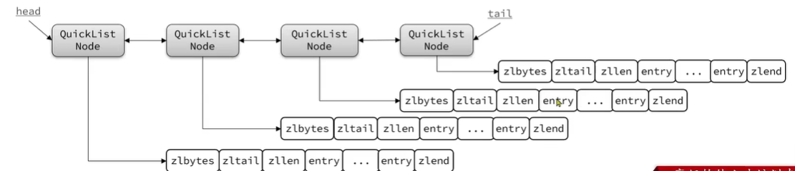

---
为了避免QuickList中的每个ZipList中entry过多，Redis提供了一个配置项: list-mas-ziplist-size来限制。  
&emsp;&emsp;如果值为正，则代表ZipList的允许的entry个数的最大值。  
&emsp;&emsp;如果值为负，则代表ZipList的最大内存代销，分5中情况:  
&emsp;&emsp;&emsp;&emsp;-1:每个ZipList的内存占用不能超过4kb  
&emsp;&emsp;&emsp;&emsp;-2:每个ZipList的内存占用不能超过8kb  
&emsp;&emsp;&emsp;&emsp;-3:每个ZipList的内存占用不能超过16kb  
&emsp;&emsp;&emsp;&emsp;-4:每个ZipList的内存占用不能超过32kb    
&emsp;&emsp;&emsp;&emsp;-5:每个ZipList的内存占用不能超过64kb  
默认值是-2  
可在redis客户端输入一下命令查看：config get list-max-ziplist-size  
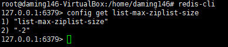