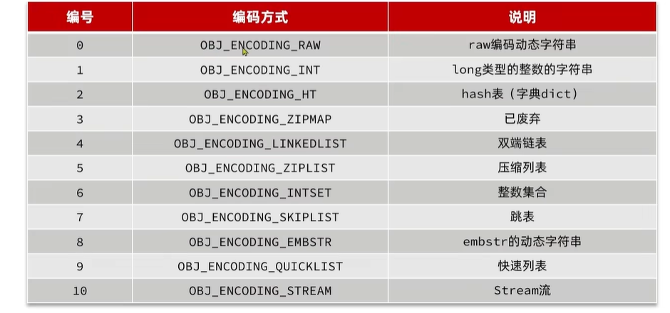

## Redis数据结构
### 态字符串SDS  
> 我们指导Redis中保存的Key是字符串，value往往是字符串或者字符串的集合，可见字符串是Redis中最常见的一种数据结构。  
> 不过Redis没有直接使用C语言中的字符串，因为C语言字符串存在很多问题：  
> 1、获取字符串长度的需要通过运算  
> 2、非二进制安全  
> 3、不可修改  
> Redis构建了一种新的字符串结构，称之为简单动态字符串(Simple Dynamic String)，简称SDS。
```markdown
struct __attribute__ ((__packed__)) sds {
    uint8_t len;  // buf 已保存的字符串字节数，不包含结束标示
    uint8_t alloc; // buf 申请的总的字节数，不包含结束标示
    unsigned char flags; // 不同SDS的头类型，用来控制SDS的头大小
    char buf[];
}
```
> SDS之所以叫动态字符串，是因为它具有动态扩容能力。  
> 如果新字符串小于1M,则新空间为扩展后字符串长度的两倍+1  
> 如果新字符串大于1M,则新空间为扩展后字符串长度+1M+1。称为内存预分配（内存预分配可减少分配内存的时间开销）  

> 优势  
> 1、获取字符长度的时间复杂度是O(1)，不需要进行运算。
> 2、支持动态扩容。
> 3、减少内存分配次数。
> 4、支持二进制安全。
### IntSet
> IntSet是Redis中set集合的一种实现，基于整数数组来实现的，并且具备长度可变、有序等特征。  
结构如下
---
```text
typedef struct intset {
    uint32_t encoding;  // 编码方式，支持放16、32、64位整数
    uint32_t length;    // 实际存储的整数个数，也就是元素个数
    int8_t contents[];  // 整数数组，保存集合数据
} intset;
```
其中的encoding包含三种模式，表示存储的整数大小不同：  
```text
#define INTSET_ENC_INT16 (sizeof(int16_t))  // 2字节整数，范围类似java的short类型
#define INTSET_ENC_INT32 (sizeof(int32_t))  // 4字节整数，范围类似java的int类型
#define INTSET_ENC_INT64 (sizeof(int64_t)) // 8字节整数，范围类似java的long类型
```
---
为了方便查找，Redis会将intset中所有的整数按照升序依次保存在contents数组中，结构图如下：

现在数组中每个数字都在int16_t的范围内，因此采用的编码方式是INTSET_ENC_INT16。，每部分占用的字节大小为：  
encoding：4字节  
length：4字节  
contents：2字节*3=6字节。
---
IntSet升级  
现在，假设有一个intset，元素为{5，10，20}，采用的是INTSET_ENC_INT16,则每个整数占2字节:

我们向其中添加一个数字：50000，这个数字超出了int16_t的范围，intset会自动升级编码方式到合适的大小。
以当前案例来说，流程如下：  
1、升级编码为INTSET_ENC_INT32,每个整数占4个字节，并按照新的编码方式以及元素个数扩容数组。  
2、倒叙依次将数组中的元素拷贝到扩容后的正确位置

3、将待添加元素放入数组末尾

4、最后，将intset的encoding属性改为INTSET_ENC_INT32，将length属性改为4

---
Intset可以看做是特殊的整数数组，具备一些特点：   
1、Redis会确保Intset中的元素唯一、有序。  
2、具备类型升级机制，可以节省内存空间。  
3、底层采用二分查找方式来查询。  
4、适合数据量比较少的情况下使用。   
---
Redis的Intset(整数集合)是专门为set集合数据类型设计的一种底层数据结构，用于在特定条件下优化内存和性能：  
1、所有元素都是整数(int64_t范围内的值)  
2、元素数量少(默认阈值：set-max-intset-entries,默认值是512，可配置)  
<font color="red">如果上述任一条件都不满足，Redis会自动将Intset升级为Hash表(Dict)结构存储。</font>    
详细源码可参考[Redis源码解析之IntSet](源码/redis/src/intset.h)
你家
### Dict基本结构    
> 我们知道Redis是一个键值型(Key-Value Pair)的数据库，我们可以根据键实现快速的增删改查。而键与值的映射关系正是通过Dict实现的。
---
Dict由三部分组成：哈希表(DictHashTable)、哈希节点(DictEntry)、字典(Dict)


当我们向Dict添加键值对时，Redis首先根据Key计算出Hash值(h)，然后利用 h&sizemask 来计算应该存储到数组中的哪个索引位置。
---
我们存储k1=v1，假设k1的哈希值h=1，则1&3=1，因此k1=v1要存储到数组角标1的位置。

如果我们继续存储k2=v2，假设k2的哈希值和key1相等时，则会在v1的位置指向k2，然后key2中的 *next 指向key1，形成了这么一个链表的结构。

### Dict扩容
> Dict中的HashTable就是数组结合单向链表实现的，当集合中元素较多时，必然导致哈希冲突增多，链表过长，则查询效率会大大降低。
---
Dict在每次新增键值对时都会检查负载因子(LoadFactor=used/size),满足以下两种情况时会触发哈希表扩容：  
1、LoadFactor>=1,并且服务器没有执行BGSAVE或者BGREWRITEAOF等后台进程;
2、LoadFactor>5；

[Reis中hash表扩容源码](源码/redis/src/dict.c)中的dictExpandIfNeeded(dict *d)方法
